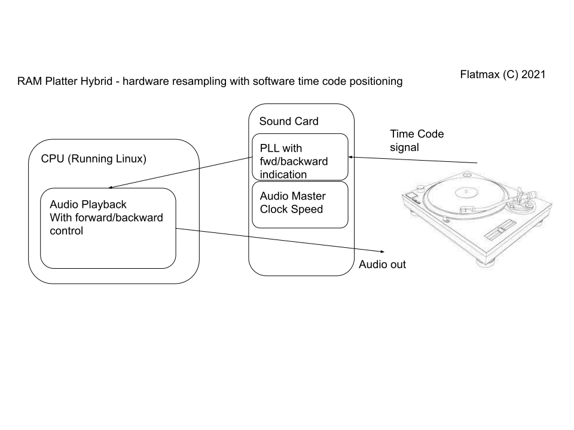

# RAM Platter Hybrid

Hybrid software / hardware DJ kit

The RAM Platter Hybrid is a hardware and software to allow digital DJing of your music.

The system implements speed change resampling in hardware. The software provides the interface and controls the audio (direction) and other signal processing.

By performing resampling in hardware, the majority of the core signal processing does not burden the CPU. This allows the system to run on low power devices. It should also allow the system latency (time lag between moving the record and hearing it move) to be reduced.
